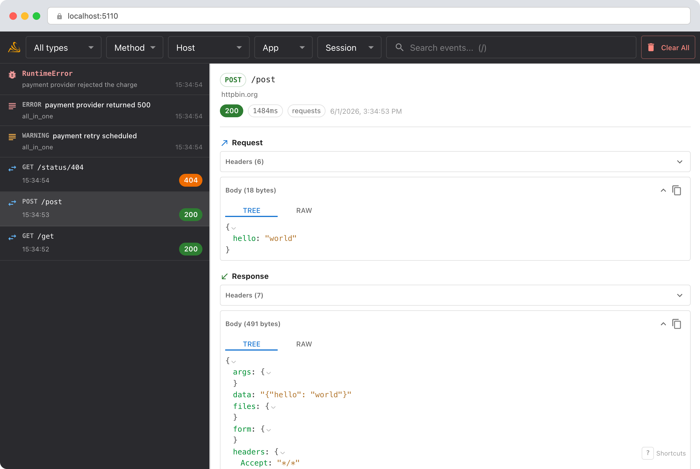

<p align="center">
  
</p>

# Smello

Capture HTTP requests, Python logs, and unhandled exceptions from your code and browse them in a local web dashboard.

Like [Mailpit](https://mailpit.axllent.org/), but for your entire debug output — HTTP traffic, log records, and crash tracebacks, all in one timeline. Add two lines to your code and open `http://localhost:5110`.

> **Why port 5110?** Read it as **5-1-1-0** → **S-L-L-O** → **smello**.

<p align="center">
  
</p>

## Quick Start

### 1. Start the server

```bash
pip install smello-server
smello-server
```

Or run with Docker:

```bash
docker run -p 5110:5110 ghcr.io/smelloscope/smello
```

### 2. Add to your code

```python
import smello
smello.init(server_url="http://localhost:5110")

# HTTP requests are captured automatically
import requests
resp = requests.get("https://api.stripe.com/v1/charges")

# Enable log capture
import logging
logging.warning("Something went wrong")  # appears in the dashboard

# Unhandled exceptions are captured with full tracebacks
```

Or leave `smello.init()` without arguments and set `SMELLO_URL` in your environment. Without a URL, `init()` is a safe no-op: no monkey-patching, no background threads, no side effects.

### Run without modifying code

For programs you don't want to (or can't) edit, wrap them with `smello run`:

```bash
smello run my_app.py                                    # .py files run with current Python
smello run --server http://localhost:5110 pytest tests/  # console scripts work directly
smello run uvicorn app:app
```

Smello activates in the wrapped process before user code runs. Subprocess instrumentation propagates automatically, so wrapping `gunicorn` also captures traffic from worker processes.

## AI Agent Skills

Smello ships with [Agent Skills](https://agentskills.io) for Claude Code, Cursor, GitHub Copilot, and [20+ other AI coding tools](https://skills.sh/).

```bash
npx skills add smelloscope/smello
```

| Skill            | Install individually                                      | Description                                                                                                                                                                       |
| ---------------- | --------------------------------------------------------- | --------------------------------------------------------------------------------------------------------------------------------------------------------------------------------- |
| `/smello-setup`    | `npx skills add smelloscope/smello --skill smello-setup`    | Explores your codebase and proposes a plan to integrate Smello (package install, entrypoint placement, Docker Compose, env vars). Does not make changes without approval.         |
| `/smello-debugger` | `npx skills add smelloscope/smello --skill smello-debugger` | Queries the Smello API to inspect captured events — HTTP traffic, log records, and exceptions. Also activates automatically when you ask about debugging. |

## What Smello Captures

### HTTP requests

For every outgoing HTTP and gRPC call:

- Method, URL, headers, and body
- Response status code, headers, and body
- Duration in milliseconds
- Library used (requests, httpx, aiohttp, grpc, or botocore)

gRPC calls are displayed with a `grpc://` URL scheme. Protobuf bodies are automatically serialized to JSON. Sensitive headers (`Authorization`, `X-Api-Key`) are redacted by default.

### Logs

When `capture_logs=True`, Smello hooks into Python's `logging` module and captures log records at or above the configured level:

- Log level, logger name, and formatted message
- Source file, line number, and function name
- Extra attributes attached to the record

### Exceptions

Unhandled exceptions are captured automatically (enabled by default):

- Exception type, message, and module
- Full formatted traceback
- Stack frames with file, line, function, and source context

## Configuration

```python
smello.init(
    server_url="http://localhost:5110",       # where to send captured data

    # HTTP capture
    capture_hosts=["api.stripe.com"],         # only capture these hosts
    capture_all=True,                          # capture everything (default)
    ignore_hosts=["localhost"],               # skip these hosts
    redact_headers=["Authorization"],         # replace header values with [REDACTED]
    redact_query_params=["api_key", "token"], # replace query param values with [REDACTED]

    # Logs & exceptions
    capture_exceptions=True,                   # capture unhandled exceptions (default)
    capture_logs=False,                        # capture log records (opt-in)
    log_level=30,                              # minimum log level to capture (WARNING)
)
```

All parameters fall back to `SMELLO_*` environment variables when not passed explicitly:

| Parameter             | Env variable                   | Default                          |
| --------------------- | ------------------------------ | -------------------------------- |
| `server_url`          | `SMELLO_URL`                   | `None` (inactive)                |
| `capture_all`         | `SMELLO_CAPTURE_ALL`           | `True`                           |
| `capture_hosts`       | `SMELLO_CAPTURE_HOSTS`         | `[]`                             |
| `ignore_hosts`        | `SMELLO_IGNORE_HOSTS`          | `[]`                             |
| `redact_headers`      | `SMELLO_REDACT_HEADERS`        | `["Authorization", "X-Api-Key"]` |
| `redact_query_params` | `SMELLO_REDACT_QUERY_PARAMS`   | `[]`                             |
| `capture_exceptions`  | `SMELLO_CAPTURE_EXCEPTIONS`    | `True`                           |
| `capture_logs`        | `SMELLO_CAPTURE_LOGS`          | `False`                          |
| `log_level`           | `SMELLO_LOG_LEVEL`             | `30` (WARNING)                   |

The server URL is the activation signal — `init()` does nothing unless `server_url` is passed or `SMELLO_URL` is set. Boolean env vars accept `true`/`1`/`yes` and `false`/`0`/`no` (case-insensitive). List env vars are comma-separated.

## API

Smello provides a JSON API for exploring captured events from the command line.

### List events

```bash
# All captured events (unified timeline)
curl -s http://localhost:5110/api/events | python -m json.tool

# Filter by event type
curl -s 'http://localhost:5110/api/events?event_type=log'

# Filter by method, host, or status (HTTP events)
curl -s 'http://localhost:5110/api/events?method=POST&host=api.stripe.com'

# Full-text search across summaries and event data
curl -s 'http://localhost:5110/api/events?search=ValueError'

# Limit results (default: 50, max: 200)
curl -s 'http://localhost:5110/api/events?limit=10'
```

### Get event details

Returns the full event data — headers/bodies for HTTP, traceback/frames for exceptions, message/extra for logs.

```bash
curl -s http://localhost:5110/api/events/{id} | python -m json.tool
```

### Clear all events

```bash
curl -X DELETE http://localhost:5110/api/events
```

## Python Version Support

| Package                 | Python  |
| ----------------------- | ------- |
| **smello** (client SDK) | >= 3.10 |
| **smello-server**       | >= 3.14 |

## Supported Libraries

- **requests** — patches `Session.send()`
- **httpx** — patches `Client.send()` and `AsyncClient.send()`
- **aiohttp** — patches `ClientSession._request()` to capture async HTTP traffic
- **grpc** — patches `insecure_channel()` and `secure_channel()` to intercept unary-unary calls
- **botocore** — patches `URLLib3Session.send()` to capture boto3 / AWS SDK traffic

### AWS libraries (boto3)

boto3 uses `botocore`, which calls `urllib3` directly, bypassing `requests` and `httpx`. Smello patches botocore's HTTP session to capture AWS API calls:

```python
import smello
smello.init(server_url="http://localhost:5110")

import boto3
s3 = boto3.client("s3")
buckets = s3.list_buckets()

# AWS calls appear at http://localhost:5110 — XML responses
# show as a collapsible tree, just like JSON.
```

### Google Cloud libraries

Many Google Cloud Python libraries use gRPC under the hood. Smello automatically captures these calls with zero additional configuration:

- **Google BigQuery** (`google-cloud-bigquery`)
- **Google Cloud Firestore** (`google-cloud-firestore`)
- **Google Cloud Pub/Sub** (`google-cloud-pubsub`)
- **Google Analytics Data API** (`google-analytics-data`) — GA4 reporting
- **Google Cloud Vertex AI** (`google-cloud-aiplatform`)
- **Google Cloud Speech-to-Text** (`google-cloud-speech`)
- **Google Cloud Vision** (`google-cloud-vision`)
- **Google Cloud Translation** (`google-cloud-translate`)
- **Google Cloud Secret Manager** (`google-cloud-secret-manager`)
- **Google Cloud Spanner** (`google-cloud-spanner`)
- **Google Cloud Bigtable** (`google-cloud-bigtable`)

Any library that calls `grpc.secure_channel()` or `grpc.insecure_channel()` is automatically captured.

## Development

Requires [uv](https://docs.astral.sh/uv/), [Node.js](https://nodejs.org/) 22+, and [just](https://just.systems/).

```bash
git clone https://github.com/smelloscope/smello.git
cd smello
uv sync

# Terminal 1: API server with auto-reload (http://localhost:5110)
just server

# Terminal 2: Frontend dev server (http://localhost:5111, proxies /api to :5110)
just frontend-install
just frontend-dev

# Terminal 3: Run an example
uv run python examples/python/basic_requests.py
```

Run `just` to see all available recipes.

## Architecture

```
Your Python App ──→ Smello Server ──→ Web Dashboard
(smello.init())     (FastAPI+SQLite)   (localhost:5110)
```

- **smello** (client SDK): Monkey-patches `requests`, `httpx`, `aiohttp`, `grpc`, and `botocore` to capture traffic. Hooks `sys.excepthook` for exceptions and `logging.Logger.callHandlers` for log records. Sends everything to the server in a background thread.
- **smello-server**: FastAPI app with SQLite. Receives captured events and serves a JSON API plus a React web dashboard with a unified timeline.

## Project Structure

```
smello/
├── server/              # smello-server (FastAPI + Tortoise ORM + SQLite)
│   └── tests/
├── frontend/            # React SPA (MUI + TanStack Query + jotai)
├── clients/python/      # smello client SDK
│   └── tests/
├── tests/test_e2e/      # End-to-end tests
└── examples/python/
```

## Contact

Questions, feedback, or ideas? Reach out at [roman@smello.io](mailto:roman@smello.io).

## License

MIT
