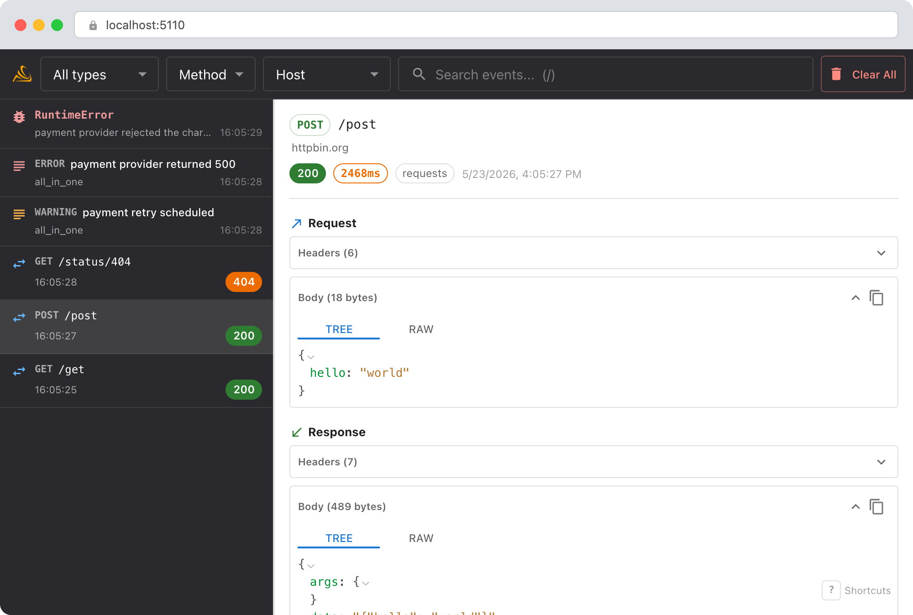
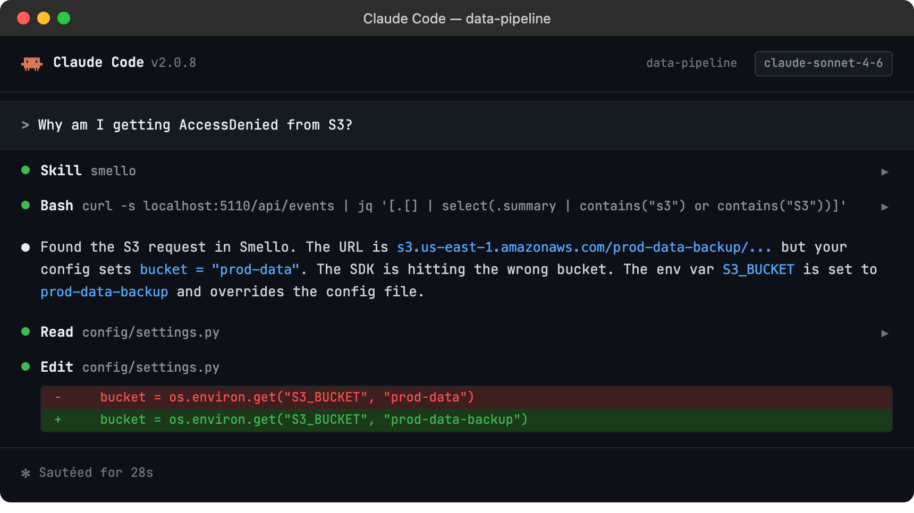

# Debug boto3 / AWS with Smello

Working with AWS through boto3 means dealing with XML responses, cryptic error codes, and IAM permission messages that don't always tell you what went wrong. Smello captures every AWS API call that boto3 makes, showing you the exact request and response including XML bodies and AWS-specific headers.

## Setup

```bash
pip install smello smello-server
smello-server  # start the dashboard
```

Then run your script with `smello run`:

```bash
smello run my_aws_script.py
```

Smello patches `botocore.httpsession.URLLib3Session.send`, which is the low-level transport that all boto3 service clients use. Every AWS API call is captured automatically. No code changes needed.

> **Example script**: [`basic_boto3.py`](https://github.com/smelloscope/smello/blob/main/examples/python/basic_boto3.py)

## Scenario: debugging an S3 access denied error

You're trying to read from an S3 bucket and getting `AccessDenied`, but your IAM policy looks correct. Is the request going to the right bucket? The right region?

```python
s3 = boto3.client("s3", region_name="us-east-1")
obj = s3.get_object(Bucket="my-data-bucket", Key="reports/2026/q1.csv")
# botocore.exceptions.ClientError: AccessDenied
```

### Debug in the dashboard

Open the Smello dashboard. The captured request shows:



- **Request URL**: the full S3 endpoint URL, including the bucket name and region. Is it `my-data-bucket.s3.us-east-1.amazonaws.com` or somewhere else?
- **Request headers**: the `Authorization` header (redacted by default, but you can see the credential scope), `x-amz-date`, and the signing region. A region mismatch between your client config and the bucket's actual region is a common cause of `AccessDenied`.
- **Response body**: AWS returns XML error responses with details like `<Code>AccessDenied</Code>` and sometimes a `<Message>` that gives more context than the Python exception.
- **Multiple requests**: boto3 sometimes makes multiple requests (e.g., a `HeadBucket` before `GetObject`). You'll see all of them in the timeline.

### Debug with an AI agent

If you use [Claude Code](https://claude.ai/code) or another AI coding tool, the `/smello` skill can query captured events and cross-reference them with your source code. Install it once:

```bash
npx skills add smelloscope/smello --skill smello
```

Then ask your agent:

```
/smello
Why am I getting AccessDenied from S3?
```



The skill is also invoked automatically when your agent recognizes a debugging question, but calling `/smello` explicitly gives the best results. See [AI Agent Skills](../ai-skills.md) for compatible tools.

## Tips

- **XML responses**: AWS API responses are XML. Smello displays them as-is in the response body panel. Use the dashboard's search to find specific error codes across multiple requests.
- **STS and IAM calls**: If your code assumes a role via STS before making S3 calls, you'll see the `AssumeRole` request in the timeline too: helpful for debugging credential chains.
- **Pagination**: Boto3 paginators make multiple API calls. Each one shows up individually in Smello, so you can spot pagination issues (e.g., a paginator that makes too many calls or stops early).
- **Retries**: Boto3 retries failed requests automatically. You'll see every attempt in the dashboard, which helps debug transient failures and rate limiting.
- **DynamoDB, SQS, Lambda, etc.**: The patch covers all AWS services, not just S3. Any call made through boto3 is captured.

--8<-- "includes/guide-next-steps.md"
