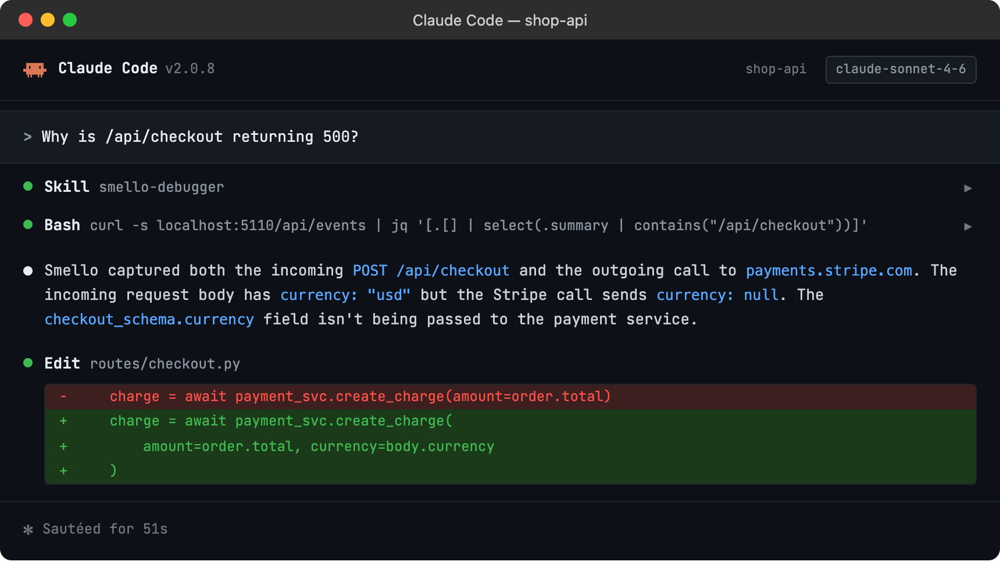

# Debug FastAPI with Smello

Smello's FastAPI middleware captures incoming HTTP requests to your FastAPI application: the request path, headers, body, response, and timing. Combined with the automatic outgoing HTTP capture, you get a complete view of what your API endpoint received and what external calls it made to handle it.

## Setup

```bash
pip install smello smello-server
smello-server  # start the dashboard
```

Add the Smello middleware to your FastAPI app:

```python
from fastapi import FastAPI
from smello.integrations.fastapi import SmelloMiddleware

app = FastAPI()
app.add_middleware(SmelloMiddleware)
```

Then run your server with `smello run`:

```bash
smello run uvicorn app:app
```

Incoming request capture is the one integration that requires a code change: adding the middleware line. Outgoing HTTP, exceptions, and logs are all captured automatically by `smello run`.

> **Example script**: [`fastapi_server.py`](https://github.com/smelloscope/smello/blob/main/examples/python/fastapi_server.py)

## Scenario: debugging a 500 error on a checkout endpoint

Your `/api/checkout` endpoint returns 500 intermittently. The logs say "internal server error" but don't show what went wrong. What did the client send? What external calls did your handler make?

```python
@app.post("/api/checkout")
async def checkout(order: OrderRequest):
    customer = await stripe_client.get_customer(order.customer_id)
    charge = await stripe_client.create_charge(customer, order.amount)
    await send_confirmation_email(customer.email, charge.id)
    return {"charge_id": charge.id}
```

### Debug in the dashboard

Open the Smello dashboard. You'll see the incoming request and all the outgoing calls it triggered:


- **Incoming request**: the full `POST /api/checkout` with the request body, headers, and the 500 response. Check the request body to see if the client sent valid data.
- **Outgoing calls**: the Stripe API call and the email service call appear in the timeline right after the incoming request. Did the Stripe call succeed but the email call fail?
- **Exception capture**: if the 500 was caused by an unhandled exception, Smello captures the full traceback. You'll see the exception type, message, and stack frames in the dashboard.
- **Duration**: the incoming request shows total duration. Compare it with the outgoing call durations to understand where time was spent.

### Debug with an AI agent

If you use [Claude Code](https://claude.ai/code) or another AI coding tool, the `/smello-debugger` skill can query captured events and cross-reference them with your source code. Install it once:

```bash
npx skills add smelloscope/smello --skill smello-debugger
```

Then ask your agent:

```
/smello-debugger
Why is /api/checkout returning 500?
```



The skill is also invoked automatically when your agent recognizes a debugging question, but calling `/smello-debugger` explicitly gives the best results. See [AI Agent Skills](../ai-skills.md) for compatible tools.

## Tips

- **Exception visibility**: The FastAPI middleware captures exceptions that propagate through your handlers. These appear as exception events in the dashboard with full tracebacks, linked to the incoming request that triggered them.
- **Route matching**: The captured incoming request shows the matched route pattern (e.g., `/api/users/{user_id}`) alongside the actual URL. This helps when debugging path parameter issues.
- **Middleware order**: Add `SmelloMiddleware` before other middleware that might modify the request or response. Smello captures what it sees, so putting it first gives you the raw client request.
- **Filtering**: Use the event type filter in the dashboard to focus on incoming requests only, or use the timeline view to see incoming and outgoing requests interleaved.
- **Health checks**: If your app has health check endpoints that generate noise, use `ignore_paths` in the middleware configuration to exclude them.

--8<-- "includes/guide-next-steps.md"
