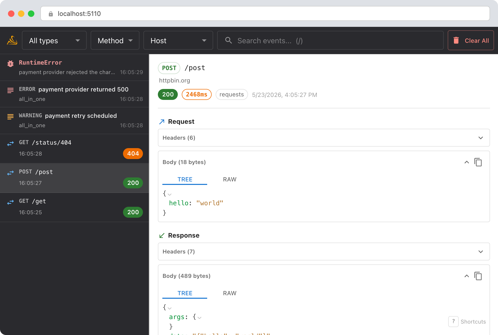
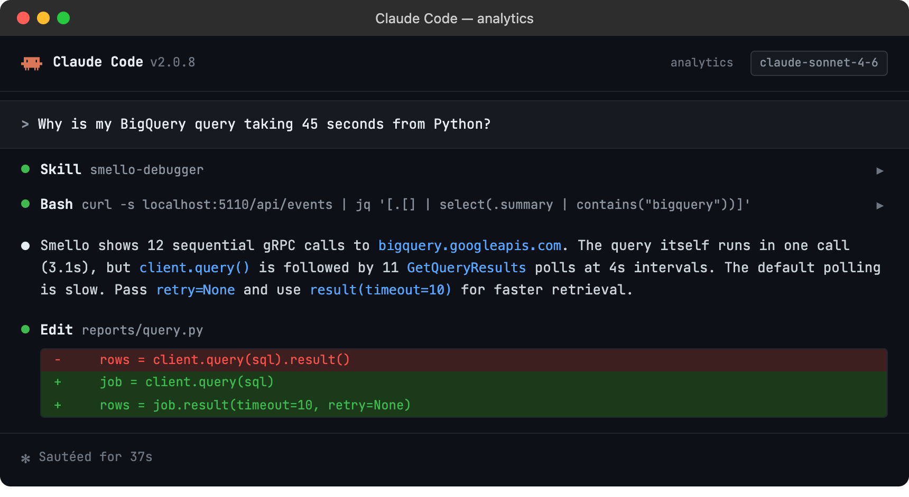

# Debug Google Cloud with Smello

Google Cloud client libraries for Python use gRPC under the hood for services like BigQuery, Firestore, Pub/Sub, and Cloud Storage. Smello captures these gRPC calls automatically, showing you the protobuf payloads as readable JSON.

## Setup

```bash
pip install smello smello-server
smello-server  # start the dashboard
```

Then run your script with `smello run`:

```bash
smello run my_bigquery_script.py
```

Smello patches `grpc.secure_channel`, which is what Google Cloud client libraries use to communicate with Google's APIs. No code changes needed.

## Scenario: debugging a slow BigQuery query

You're running a BigQuery query from Python and it takes much longer than expected. Is the query itself slow, or is something else going on?

```python
client = bigquery.Client()
query = "SELECT * FROM `project.dataset.large_table` WHERE date > '2026-01-01'"
rows = client.query(query).result()
# Takes 45 seconds: the query runs in 3 seconds in the BigQuery console
```

### Debug in the dashboard

Open the Smello dashboard. You'll see multiple gRPC calls that the BigQuery client makes:



- **`google.cloud.bigquery.v2.JobService/InsertJob`**: the initial query submission. Check the request payload to confirm the SQL and any query parameters.
- **`google.cloud.bigquery.v2.JobService/GetJob`**: the client polls for completion. Count how many poll requests there are and their timing: the polling interval might be the bottleneck.
- **`google.cloud.bigquery.v2.JobService/GetQueryResults`**: fetching results. A large result set means multiple fetches.

The timeline view shows the full sequence and timing, so you can see where the 45 seconds goes.

### Debug with an AI agent

If you use [Claude Code](https://claude.ai/code) or another AI coding tool, the `/smello-debugger` skill can query captured events and cross-reference them with your source code. Install it once:

```bash
npx skills add smelloscope/smello --skill smello-debugger
```

Then ask your agent:

```
/smello-debugger
Why is my BigQuery query taking 45 seconds from Python?
```



The skill is also invoked automatically when your agent recognizes a debugging question, but calling `/smello-debugger` explicitly gives the best results. See [AI Agent Skills](../ai-skills.md) for compatible tools.

## Tips

- **gRPC payloads as JSON**: Protobuf messages are displayed as JSON in the dashboard, so you can read BigQuery job configs, Firestore documents, and Pub/Sub messages without decoding binary protobufs.
- **REST fallback**: Some Google Cloud libraries support a REST transport as an alternative to gRPC. If you're using REST transport, Smello captures those via the `requests` or `httpx` patches instead.
- **Authentication**: Google Cloud libraries handle OAuth2 token refresh automatically. You'll see token refresh calls in the timeline if they happen: useful for debugging auth issues.
- **Multiple services**: If your code calls BigQuery, Firestore, and Pub/Sub in the same request, all the gRPC calls appear in the timeline together.

--8<-- "includes/guide-next-steps.md"
