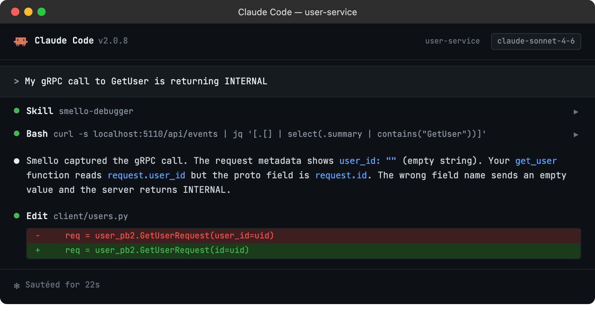

# Debug gRPC with Smello

gRPC calls are notoriously hard to debug: binary protobuf payloads, HTTP/2 transport, and no browser dev tools to inspect traffic. Smello intercepts `grpc.insecure_channel` and `grpc.secure_channel` to capture unary-unary gRPC calls and display them as readable JSON in the dashboard.

## Setup

```bash
pip install smello smello-server
smello-server  # start the dashboard
```

Then run your script with `smello run`:

```bash
smello run my_app.py
```

Smello patches gRPC channel creation. When your code creates a channel and makes RPC calls, the request and response messages are captured automatically. No code changes needed.

> **Example script**: [`basic_grpc.py`](https://github.com/smelloscope/smello/blob/main/examples/python/basic_grpc.py)

## Scenario: debugging a gRPC call that returns an unexpected status

You're calling a gRPC service and getting `StatusCode.INTERNAL` with no helpful error message. What did you actually send?

```python
channel = grpc.insecure_channel("localhost:50051")
stub = MyServiceStub(channel)
response = stub.GetUser(GetUserRequest(user_id="abc-123"))
# grpc.RpcError: StatusCode.INTERNAL
```

### Debug in the dashboard

Open the Smello dashboard. The captured gRPC call shows:


- **Method path**: the full gRPC method (e.g., `/mypackage.MyService/GetUser`) so you can confirm you're calling the right service and method.
- **Request payload**: the protobuf message serialized as JSON, so you can inspect the exact fields and values sent.
- **Response or error**: for failed calls, you'll see the gRPC status code and any error details the server included.
- **Duration**: helps distinguish between fast rejections (validation errors) and slow failures (timeouts).

### Debug with an AI agent

If you use [Claude Code](https://claude.ai/code) or another AI coding tool, the `/smello-debugger` skill can query captured events and cross-reference them with your source code. Install it once:

```bash
npx skills add smelloscope/smello --skill smello-debugger
```

Then ask your agent:

```
/smello-debugger
My gRPC call to GetUser is returning INTERNAL
```



The skill is also invoked automatically when your agent recognizes a debugging question, but calling `/smello-debugger` explicitly gives the best results. See [AI Agent Skills](../ai-skills.md) for compatible tools.

## Tips

- **Unary-unary only**: Smello currently captures unary-unary gRPC calls. Streaming RPCs (server-streaming, client-streaming, bidirectional) are not captured yet.
- **Google Cloud APIs**: Many Google Cloud client libraries (BigQuery, Firestore, Pub/Sub) use gRPC under the hood. See the [Google Cloud guide](debug-google-cloud.md) for details.
- **Protobuf as JSON**: gRPC payloads appear as JSON in the dashboard, making them much easier to read than raw protobuf binary.
- **Channel types**: Both `grpc.insecure_channel` and `grpc.secure_channel` are patched.

--8<-- "includes/guide-next-steps.md"
