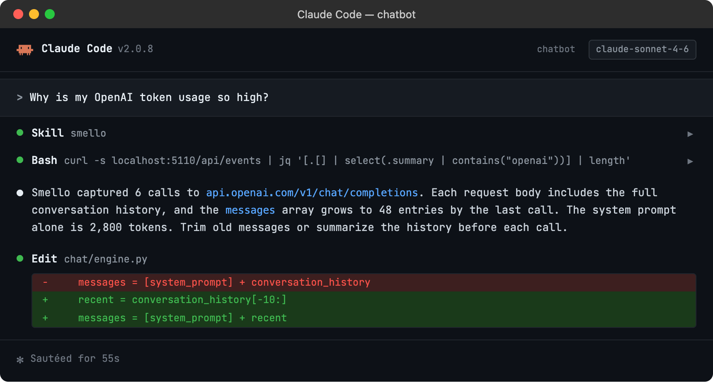

# Debug OpenAI with Smello

The OpenAI Python SDK wraps a complex HTTP API behind convenient methods like `client.chat.completions.create()`. When something goes wrong (unexpected responses, rate limits, token overages), you need to see the raw API calls. Smello captures the HTTP requests that the OpenAI SDK makes through httpx, showing you exactly what's sent and received.

## Setup

```bash
pip install smello smello-server
smello-server  # start the dashboard
```

Then run your script with `smello run`:

```bash
smello run my_openai_app.py
```

The OpenAI SDK uses `httpx` under the hood. Smello's httpx patch captures all API calls automatically. No code changes needed.

## Scenario: debugging unexpected token usage

You're making chat completion calls and your token usage is higher than expected. Is it the system prompt? Are previous messages being included that you didn't intend?

```python
client = OpenAI()
response = client.chat.completions.create(
    model="gpt-4o",
    messages=build_messages(user_input),
)
# usage.total_tokens is 12,000: way more than expected
```

### Debug in the dashboard

Open the Smello dashboard and click the request to `api.openai.com/v1/chat/completions`:


- **Request body**: see the full `messages` array that was sent. Is `build_messages()` including the entire conversation history? Is the system prompt larger than you thought?
- **Response body**: the `usage` object shows `prompt_tokens`, `completion_tokens`, and `total_tokens`. Compare `prompt_tokens` with what you expected from your message array.
- **Request headers**: confirm which API key and organization are being used (redacted by default, but the `OpenAI-Organization` header is visible).

### Debug with an AI agent

If you use [Claude Code](https://claude.ai/code) or another AI coding tool, the `/smello` skill can query captured events and cross-reference them with your source code. Install it once:

```bash
npx skills add smelloscope/smello --skill smello
```

Then ask your agent:

```
/smello
Why is my OpenAI token usage so high?
```



The skill is also invoked automatically when your agent recognizes a debugging question, but calling `/smello` explicitly gives the best results. See [AI Agent Skills](../ai-skills.md) for compatible tools.

## Tips

- **Streaming responses**: When using `stream=True`, Smello captures the initial request and the full response. You can see the complete streamed output in the response body, even though your code received it token by token.
- **Rate limit headers**: OpenAI returns `x-ratelimit-remaining-requests`, `x-ratelimit-remaining-tokens`, and related headers. These are visible in the response headers panel: useful for understanding why you're hitting rate limits.
- **Function calling / tools**: If you're using function calling, the tool definitions are part of the request body and the tool call responses are in the response body. Smello shows both, so you can debug tool-use flows.
- **Multiple API calls**: Chat, embeddings, image generation, and file uploads all go through the same httpx client. You'll see all of them in the timeline, filterable by URL.
- **Retries**: The OpenAI SDK retries on certain errors automatically. Each attempt appears as a separate request in Smello, so you can see what was retried and why.

--8<-- "includes/guide-next-steps.md"
